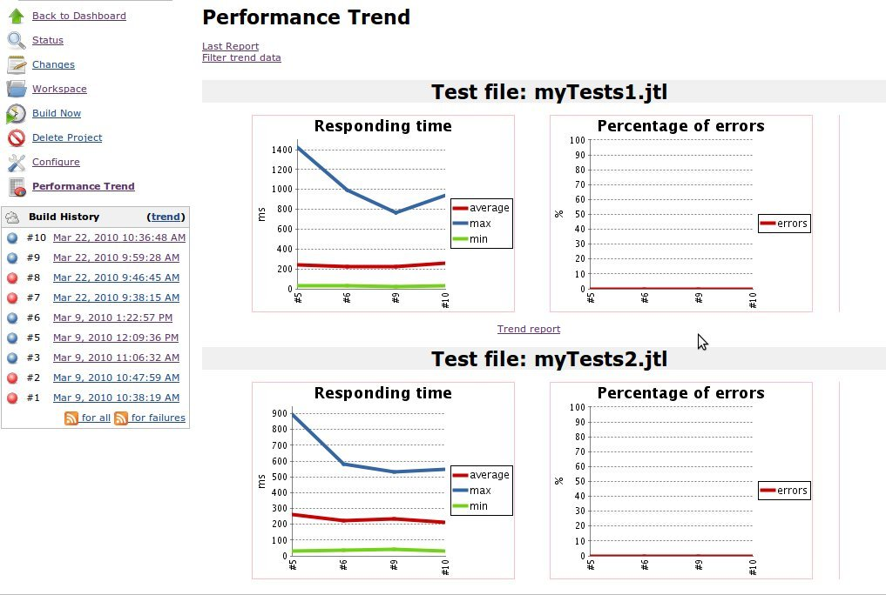
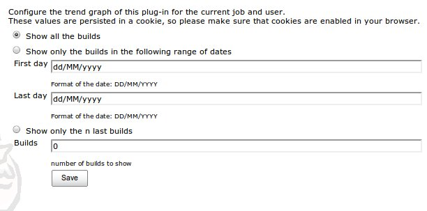
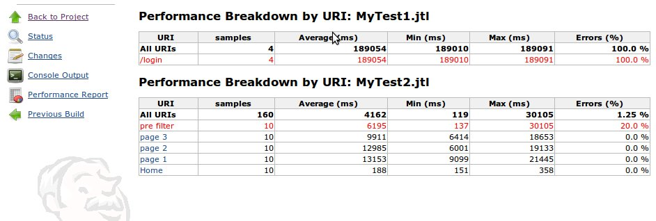

<small>[<< Back to main page](./)</small>
# Performance Trend Reporting

## Features
Performance Report post-build step allows you to generate reports from popular testing tools. Jenkins will generate graphic charts with the trend report of performance and robustness.

It includes the feature of setting the final build status as good, unstable or failed, based on the reported error percentage.

Report formats supported:
- JMeter XML and CSV format, also Summarizer log output
- Taurus Tool Final Stats XML (through it, you can publish summaries from JMeter, Gatling, Grinder, Siege, ab, Selenium and many others)
- JUnit format (used by SoapUI for example)
- Twitter's Iago
- wrk

As soon as you have configured Jenkins to run this post-build action and launched a first build, you'll notice that a new entry is appearing in the left pane: Performance Trend.

If you just have one report file, the graph of this reports will appear on the main page.

If you have more than one report file, you have to click on "Performance Trend" and the graphs will appear.




The link: Filter trend data in the Performance Trend Page, will permit you to configure the graphs. When you click on it, you obtain the graph configuration menu.

This configuration will be saved in a cookie named performance. The default configuration is: "Show all the builds".


         
         
The link Last report in the Performance Trend Page, give us the detailed information of each report for the last build.

You can access to the data of old builds pushing on the new menu entry of each build named Performance report.




In the performance trend page, the links to Trend report shows a report with the history data of each build.


## Jenkins GUI Configuration

Specify the report files, separated by semicolon. Plugin will autodetect file format for each file. You can use Jenkins globs like `**/*.jtl`.

You can configure the error percentage thresholds which would make the project unstable or failed or leave them blank to disable the feature.

## Using from Pipeline Scripts

You can use Pipleline Script builder to build groovy script piece from GUI. Additinally, Performance Plugin offers "perfReport" Groovy command that allows shorthand use to simply build report, it will autodetect source file format:
 
```groovy
perfReport 'result.csv'
```

Minimal command for old-style invocation is this:

```groovy
performanceReport parsers: [[$class: 'JMeterParser', glob: 'result.xml']], relativeFailedThresholdNegative: 1.2, relativeFailedThresholdPositive: 1.89, relativeUnstableThresholdNegative: 1.8, relativeUnstableThresholdPositive: 1.5
```
